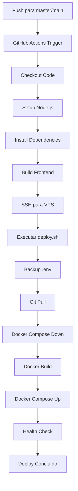

# 🚀 Sistema de Deploy Automático

Este documento explica como funciona o sistema de deploy automático configurado para o projeto de monitoramento.

## 📋 Visão Geral

O sistema está configurado para fazer deploy automático sempre que houver um push para a branch `master` ou `main` do repositório GitHub.

## 🔧 Componentes do Sistema

### 1. GitHub Actions (`.github/workflows/deploy.yml`)
- **Trigger**: Push para branches `master` ou `main`
- **Ambiente**: Ubuntu Latest
- **Etapas**:
  - Checkout do código
  - Setup do Node.js 18
  - Instalação de dependências (frontend e backend)
  - Build do frontend
  - Deploy via SSH para a VPS

### 2. Script de Deploy na VPS (`deploy.sh`)
Localizado em `/root/uptime-monitor/deploy.sh`, este script executa:

- ✅ Backup automático do arquivo `.env`
- ✅ Pull das alterações do repositório
- ✅ Restauração do arquivo `.env`
- ✅ Parada segura dos containers
- ✅ Build dos containers (sem cache)
- ✅ Inicialização dos containers
- ✅ Verificação de saúde dos containers
- ✅ Teste de conectividade dos serviços
- ✅ Limpeza de imagens não utilizadas
- ✅ Logs detalhados com timestamp

## 🔐 Secrets Configurados no GitHub

As seguintes secrets devem estar configuradas no repositório GitHub:

| Secret | Descrição | Valor |
|--------|-----------|-------|
| `SSH_HOST` | IP da VPS | `85.31.62.181` |
| `SSH_USERNAME` | Usuário SSH | `root` |
| `SSH_PRIVATE_KEY` | Chave privada SSH | (chave privada) |
| `SSH_PORT` | Porta SSH (opcional) | `22` (padrão) |
| `PROJECT_PATH` | Caminho do projeto na VPS | `/root/uptime-monitor` (padrão) |

## 🔄 Fluxo de Deploy



## 📊 Monitoramento do Deploy

### Logs do GitHub Actions
- Acesse a aba "Actions" no repositório GitHub
- Visualize os logs detalhados de cada deploy

### Logs na VPS
O script `deploy.sh` gera logs detalhados com timestamp para facilitar o debugging.

### Verificação de Saúde
O script automaticamente verifica:
- Status dos containers Docker
- Conectividade do frontend (porta 3000)
- Conectividade do backend (porta 8081)

## 🛠️ Manutenção

### Backup do .env
- Backups automáticos são criados a cada deploy
- Apenas os 5 backups mais recentes são mantidos
- Formato: `.env.backup.YYYYMMDD_HHMMSS`

### Limpeza Automática
- Imagens Docker não utilizadas são removidas automaticamente
- Backups antigos do .env são removidos automaticamente

## 🚨 Troubleshooting

### Deploy Falhou
1. Verifique os logs no GitHub Actions
2. Conecte na VPS e verifique os logs do Docker:
   ```bash
   cd /root/uptime-monitor
   docker compose logs
   ```

### Containers não Iniciam
1. Verifique se há conflitos de porta:
   ```bash
   netstat -tulpn | grep -E "(3000|8081)"
   ```
2. Verifique os logs dos containers:
   ```bash
   docker compose logs backend
   docker compose logs frontend
   ```

### Problemas de Conectividade
1. Verifique se o Nginx está rodando:
   ```bash
   systemctl status nginx
   ```
2. Teste a conectividade local:
   ```bash
   curl http://localhost:3000
   curl http://localhost:8081/health
   ```

## 📝 Próximos Passos

Para testar o sistema:
1. Faça uma pequena alteração no código
2. Commit e push para a branch master
3. Acompanhe o deploy no GitHub Actions
4. Verifique se as alterações foram aplicadas em produção

## 🔗 Links Úteis

- **Produção**: https://monitor.pagina1digital.com.br/
- **GitHub Actions**: [Link para Actions do repositório]
- **VPS SSH**: `ssh root@85.31.62.181`